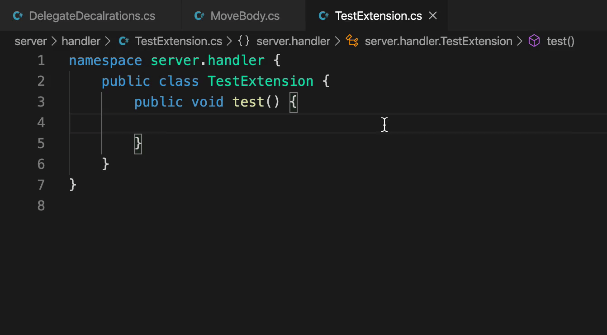

# csharp-autousing-workspace

A simple plugin, search for namespaces and symbols and auto import them when needed.

## Feature

## Important note

This plugin is developed to used by myself so it's not guaranteened to be worked your side.
There are several reasons that it won't work:

-   Vscode language (Should be english)
-   You start a new line for the {}
-   ...

However, you are welcome to fork and modify the code to make it useable.
